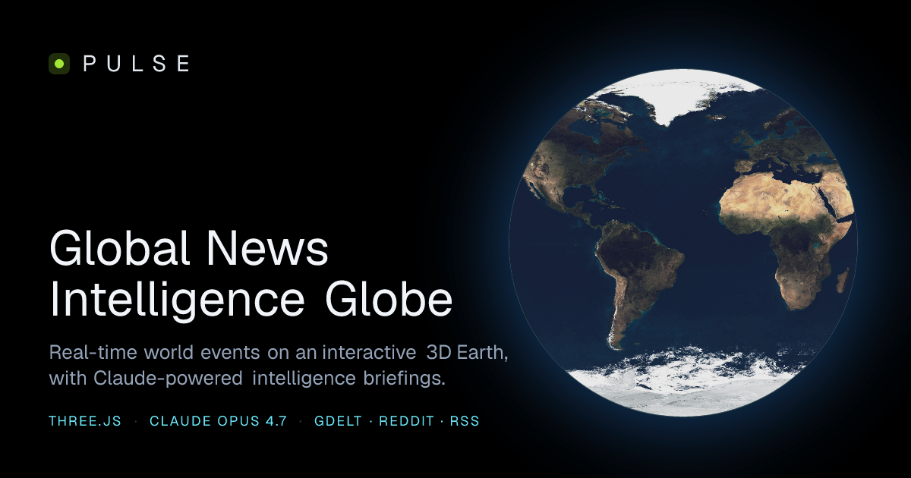

# 🌍 Pulse, Global News Intelligence Globe

An interactive, real-time 3D globe that visualizes breaking news from around the
world as glowing event clusters, and generates **Claude-powered intelligence
briefings** for any event you click. Built as a mission-control style
intelligence dashboard: dark, cinematic, data-dense.

> Real-time world events on a photoreal Earth · 1,000+ live events from 45+ news
> feeds · Claude Opus 4.7 analysis · embedded live TV channels · markets,
> commodities, earthquakes, and more.

---

## Table of contents

1. [What it does](#what-it-does)
2. [Live demo & screenshots](#live-demo--screenshots)
3. [Tech stack](#tech-stack)
4. [High-level architecture](#high-level-architecture)
5. [The data pipeline (backend)](#the-data-pipeline-backend)
6. [The AI layer (Claude)](#the-ai-layer-claude)
7. [The 3D globe (frontend rendering)](#the-3d-globe-frontend-rendering)
8. [The HUD & dashboards](#the-hud--dashboards)
9. [Full API reference](#full-api-reference)
10. [State management](#state-management)
11. [Project structure](#project-structure)
12. [Local development](#local-development)
13. [Environment variables](#environment-variables)
14. [Deploying to Vercel](#deploying-to-vercel)
15. [Cost, rate limiting & safety](#cost-rate-limiting--safety)
16. [Keyboard shortcuts](#keyboard-shortcuts)
17. [Data sources & attribution](#data-sources--attribution)
18. [Performance notes](#performance-notes)
19. [Troubleshooting](#troubleshooting)
20. [License](#license)

---

## What it does

Pulse pulls live news from many global sources, geolocates each story, clusters
nearby stories into "hotspots," and renders them as pulsing markers on a
photorealistic 3D Earth. The right-hand **Intelligence Brief** panel shows
real-time signals; click any cluster and Claude streams a structured analyst
briefing (what happened, why it matters, connected events, historical
parallels, key actors, severity, and a 12-hour sentiment forecast).

Core capabilities:

- **Live 3D globe** with 8K NASA Blue Marble textures, day/night terminator,
  city lights, atmosphere, aurorae, satellites, a moon, and earthquake ripples.
- **1,000+ live events** aggregated from GDELT, Reddit (45 subreddits), 45+ RSS
  feeds (Reuters, BBC, AP, Al Jazeera, NHK, SCMP, Le Monde, Globo, etc.), and
  Hacker News, deduped and geocoded.
- **Claude Opus 4.7 intelligence**: streaming event briefings, anomaly
  detection, cross-cluster narratives, 24-hour forecasts, daily digest, and an
  "Ask Claude" chat that knows the current globe state.
- **Embedded live TV** from major news networks (Fox, BBC, Al Jazeera, France
  24, DW, Bloomberg, CNBC, NHK, and more).
- **Markets & data rails**: equity indices, commodities, FX, crypto, USGS
  earthquakes.
- **Mission-control HUD**: time-scrub replay of the last 24h, category layer
  toggles, regional breakdown, trending entities, sentiment timeline, world
  clocks, polar minimap, tactical board.
- **Power features**: view modes (satellite/political/heatmap), themes,
  bookmarks, fuzzy search, voice input, devil's-advocate & counterfactual
  reframing, cross-language briefings, screenshot/4K poster export, timelapse
  video recording, markdown & PDF report export, shareable deep links, embed
  widget, RSS digest feed, PWA install.

---

## Live demo & screenshots

**▶ Live app: [global-pulse-ai.site](https://global-pulse-ai.site)**

Also: [embed widget](https://global-pulse-ai.site/embed) · [printable report](https://global-pulse-ai.site/report) · [RSS digest](https://global-pulse-ai.site/api/rss/digest) · [social card](https://global-pulse-ai.site/opengraph-image)

<!-- Hero: committed static render of the social card (no function calls on repo views) -->


<!--
  GALLERY: uncomment this block once you add the capture files into docs/.
  Until then it stays hidden so the README shows no broken image links.

  <table>
    <tr>
      <td width="50%"></td>
      <td width="50%"></td>
    </tr>
    <tr>
      <td width="50%"></td>
      <td width="50%"></td>
    </tr>
  </table>

  
-->

> **Add your own screenshots / demo GIF** (all capture tools are built into the app), then uncomment the gallery block in this file:
> 1. **Stills:** open the live site, frame a shot, click **Export, HD** (or **4K poster**) in the top bar. Save into `docs/` as `globe.png`, `briefing.png` (open a cluster first), `intel.png` (scroll the right panel), and `mobile.png` (phone screenshot).
> 2. **Demo GIF:** click **REC** on the bottom timeline to capture a 10s `.webm`, then convert to `docs/demo.gif` (e.g. `ffmpeg -i pulse-timelapse.webm -vf "fps=15,scale=900:-1" docs/demo.gif`).
> 3. Commit `docs/` and uncomment the `<table>` + GIF block above.

---

## Tech stack

| Layer            | Technology                                                        |
| ---------------- | ----------------------------------------------------------------- |
| Framework        | **Next.js 16** (App Router, React 19, React Compiler)             |
| Language         | **TypeScript 5** (end-to-end typed)                               |
| 3D / WebGL       | **Three.js 0.184** + **@react-three/fiber 9** + **drei** + **postprocessing** |
| Styling          | **Tailwind CSS v4**                                               |
| State            | **Zustand 5** (+ `persist` middleware)                            |
| Data fetching    | **SWR 2** (client), native `fetch` with `AbortController` (server) |
| AI               | **Anthropic SDK**, `claude-opus-4-7`, streamed                   |
| Geo data         | **topojson-client** + world-atlas (country polygons)             |
| Export           | **html-to-image**, MediaRecorder, SpeechSynthesis                 |
| Deployment       | **Vercel** (Pro recommended for 60s functions)                   |

---

## High-level architecture

```
┌──────────────────────────────────────────────────────────────────────┐
│                          BROWSER (client)                              │
│                                                                        │
│  ┌────────────────┐   ┌─────────────────┐   ┌──────────────────────┐  │
│  │  3D Globe       │   │  HUD overlays    │   │  Intelligence panel   │  │
│  │  (R3F / Three)  │   │  (left/right/    │   │  + Briefing + Chat    │  │
│  │                 │   │   bottom rails)  │   │  (Claude, streamed)   │  │
│  └───────┬─────────┘   └────────┬─────────┘   └──────────┬───────────┘  │
│          │                      │                         │             │
│          └──────────── Zustand global store ──────────────┘             │
│                               │  SWR polling (5 min)                    │
└───────────────────────────────┼────────────────────────────────────────┘
                                 │  HTTP
┌───────────────────────────────┼────────────────────────────────────────┐
│                     NEXT.JS API ROUTES (server)                         │
│                                                                          │
│  /api/news/globe   ← GDELT geo + Reddit + RSS + HN → geocode → cluster  │
│  /api/news/feed    ← Reddit + RSS + HN (fast, no GDELT)                 │
│  /api/news/brief   → Claude streaming briefing (per cluster)            │
│  /api/news/anomalies, /narratives, /forecast, /digest, /chat → Claude   │
│  /api/data/stocks, /commodities, /earthquakes → market & USGS data       │
│  /api/rss/digest   → XML feed of the AI daily digest                    │
└──────────────────────────────────────────────────────────────────────┘
                                 │
        ┌────────────────────────┼─────────────────────────┐
        ▼                        ▼                          ▼
   GDELT 2.0 API          Reddit / RSS / HN           Anthropic API
   (geo events)           (headlines)                 (Claude Opus 4.7)
```

Everything server-side degrades gracefully: if any source is unreachable, the
others still populate the globe, and if all news sources fail there is a
built-in mock dataset so the app is never empty.

---

## The data pipeline (backend)

This is the heart of the "global news intelligence." It lives in `lib/` and is
orchestrated by the API routes.

### 1. Source fetchers (`lib/`)

| File                | Source                | What it returns                                                |
| ------------------- | --------------------- | -------------------------------------------------------------- |
| `gdelt.ts`          | GDELT 2.0 Geo + Doc   | Geocoded global events (lat/lng baked in) + article headlines. |
| `reddit-news.ts`    | 45 subreddits         | Hot posts across world/news/politics/business/tech/science/sports/etc., filtered for real outbound article links. |
| `rss-sources.ts`    | 45+ RSS feeds         | Reuters, BBC, AP, Al Jazeera, France 24, DW, NHK, Nikkei, SCMP, The Hindu, AllAfrica, Globo, TechCrunch, NASA, WHO, ESPN, Variety, etc. |
| `hackernews.ts`     | Hacker News Firebase  | Top tech/science stories.                                      |
| `mock-events.ts`    | bundled fallback      | ~80 realistic worldwide events, used only when every live source is unreachable. URLs resolve to Google News searches. |

Each fetcher uses an `AbortController` timeout (2.5 to 3.5s) so one slow source
can't stall the whole request. Each returns a normalized `RawEvent`:

```ts
interface RawEvent {
  id: string;
  lat: number; lng: number;     // 0,0 if not yet geocoded
  title: string;
  url: string;                  // real article link
  source: string;               // domain, e.g. "bbc.com"
  datetime: string;             // ISO
  tone: number;                 // -10..+10 sentiment
  category: Category;           // classified from the headline text
}
```

### 2. Category classification (`gdelt.ts → classify()`)

Each headline is scored against keyword banks for 10 categories: **conflict,
politics, economy, environment, wildlife, tech, science, health, culture,
other**. The highest-scoring category wins. Colors and labels live in
`lib/types.ts`.

### 3. Geocoding (`lib/geocoder.ts`)

Reddit / RSS / HN headlines have no coordinates, so we geolocate them:

1. **`geocodeHeadlineAll(title)`** scans the headline for any of ~200 known
   places, 60+ major cities, 60+ countries, US states, regions, and 30+
   leader/institution aliases ("Trump"→DC, "Putin"→Moscow, "Hamas"→Gaza,
   "EU"→Brussels, etc.). A headline can match up to 3 places, producing one
   event per place so a "US-Iran talks" story shows in both Washington and
   Tehran. Longer names win over shorter ("South Korea" beats "Korea").
2. **`geocodeBySource(domain)`** is the fallback: if no place is found, the
   story is anchored at the **newsroom HQ** of its source outlet (75+ outlets
   mapped, BBC→London, Al Jazeera→Doha, NHK→Tokyo, Globo→Rio, …) with a small
   random jitter so same-source stories spread out instead of stacking.

This two-tier approach means almost every headline lands somewhere sensible,
which is how the globe reaches 1,000+ plotted events.

### 4. Spatial clustering (`lib/clustering.ts`)

`clusterEvents(events, radiusKm)` uses **grid-based spatial clustering**: the
globe is divided into cells ~`radiusKm/111` degrees wide (120 km in
production). Events in the same cell merge into one `Cluster`:

```ts
interface Cluster {
  id: string;
  lat: number; lng: number;     // centroid of merged events
  events: RawEvent[];
  intensity: number;            // 0.25..1, scales with event count
  category: Category;           // dominant (most common) category
  color: string;
  dominantTitle: string;        // most "tonal" headline
}
```

### 5. Orchestration (`app/api/news/globe/route.ts`)

```
Promise.allSettled([ GDELT geo, RSS, Reddit, HackerNews ])
  → geocode the non-GDELT events (headline match, else source HQ)
  → merge with GDELT geo events
  → clusterEvents(all, 120km)
  → return { clusters, totalEvents, fetchedAt }
```

Responses are cached (`s-maxage=300, stale-while-revalidate=600`) so visitors
share one upstream fetch every 5 minutes. The client polls via SWR on the same
cadence.

### 6. Market & geophysical data (`app/api/data/*`)

- `stocks`, 12 global equity indices (S&P, Nasdaq, Nikkei, FTSE, DAX, Sensex…)
- `commodities`, gold, silver, oil (WTI/Brent), gas, copper, wheat, coffee +
  FX pairs + BTC/ETH/SOL
- `earthquakes`, **live USGS** M4.5+ feed (real data), with a fallback set

Market values use a deterministic 5-minute-seeded random walk around realistic
baselines (so they move believably without a paid markets API; swap in a real
feed by editing these routes).

---

## The AI layer (Claude)

All AI runs server-side through the Anthropic SDK (`lib/claude.ts`,
`BRIEFING_MODEL = "claude-opus-4-7"`). Every route degrades to a useful
non-AI fallback if `ANTHROPIC_API_KEY` is missing or the call fails.

| Endpoint                 | Purpose                                                                 | Notable behavior |
| ------------------------ | ----------------------------------------------------------------------- | ---------------- |
| `/api/news/brief`        | Per-cluster analyst briefing                                            | **Streamed** token-by-token; supports `framing: devil \| counterfactual` and `language: es\|fr\|hi\|zh\|ar\|de`. |
| `/api/news/anomalies`    | Detects 3 to 4 statistically/geopolitically notable patterns              | Fingerprint-cached. |
| `/api/news/narratives`   | Groups distant clusters into single story threads                       | Fingerprint-cached. |
| `/api/news/forecast`     | Predicts 3 to 4 developments in the next 24h with probabilities            | Fingerprint-cached. |
| `/api/news/digest`       | "What mattered today" narrative digest                                  | Used by `/report` and `/api/rss/digest`. |
| `/api/news/chat`         | "Ask Claude", answers questions using live globe state as context      | Keeps short history. |

### Streaming briefings

`/api/news/brief` opens an Anthropic stream and pipes each `text_delta` to the
browser through a `ReadableStream`. The client (`BriefingPanel`) repairs the
partial JSON on every chunk (`lib/partial-json.ts`) and re-renders, so the
"What happened" section appears within ~1s instead of waiting ~5s for the full
response.

### Caching

`lib/ai-cache.ts` is a 10-minute fingerprint cache. Narratives/forecast/anomaly
results are keyed by a hash of the current cluster set, so identical globe
states reuse the previous Claude answer instead of paying for it again.

---

## The 3D globe (frontend rendering)

Built with react-three-fiber. The scene graph (`components/Globe/Globe.tsx`):

| Component            | What it renders                                                              |
| -------------------- | ---------------------------------------------------------------------------- |
| `Earth.tsx`          | Sphere with a custom GLSL shader blending **8K day texture** and **8K night-lights texture** across the real sun-position terminator, plus specular ocean shine, normal-map relief, and a warm terminator glow. Switches to a canvas-rendered political map in "political" view. Handles hover (lat/lng readout) and click (country drilldown). |
| `Atmosphere.tsx`     | Back-side Fresnel shader shell, the thin blue rim halo.                     |
| `Stars.tsx`          | 7,000 GPU points, color-varied, slowly rotating starfield.                   |
| `Moon.tsx`           | Procedurally-cratered moon orbiting at distance with its own light.          |
| `Auroras.tsx`        | FBM-noise shader curtains over the poles; **hue reacts to global tone** (shifts red when the news mood is negative). |
| `Satellites.tsx`     | Animated orbital trails with leading dots.                                   |
| `Lightning.tsx`      | Flashes over conflict/environment clusters on the night side.                |
| `CityDots.tsx`       | 60+ major cities that fade in as you zoom closer.                            |
| `CountryHighlight.tsx` | Glowing cyan outline of the country under your cursor (point-in-polygon).   |
| `Earthquakes.tsx`    | Expanding concentric ripples at live USGS epicenters.                        |
| `NewsCluster.tsx`    | The pulsing event markers, a category-shaped sprite (triangle=conflict, hexagon=tech, atom=science, leaf=environment, …) + a soft halo. Distance-aware scaling keeps them readable from any zoom; halos fade out at extreme close-up so they don't occlude the surface. |
| `ConnectionArc.tsx`  | Animated dashed great-circle arcs between a selected cluster and related ones.|

`lib/globe-utils.ts` does the lat/lng → 3D vector math and builds the Bezier
arcs. `lib/earth-canvas.ts` and `lib/political-canvas.ts` build the political
map texture from world-atlas polygons. `lib/cluster-icons.ts` draws the
per-category sprite icons on a canvas.

Rendering uses ACES filmic tone mapping + a tuned bloom pass
(`@react-three/postprocessing`). `GlobeErrorBoundary` catches any WebGL/shader
error and shows a reload prompt instead of a black screen.

---

## The HUD & dashboards

Overlaid on the globe, organized into rails:

**Top bar** (`TopBar.tsx`): PULSE logo, search, view-mode toggle (SAT/POL/HEAT),
theme switcher, data-source badge, UTC clock, sound toggle, tweet/export/help.

**Left rail** (`FilterPanel.tsx`): live event/cluster counters, timespan
selector, category **layer toggles**, event velocity, world clocks, markets,
commodities tape.

**Right rail** (`IntelligencePanel.tsx`): live TV channel grid
(`LiveStreams.tsx`), live activity feed, trending entities, priority alerts,
**AI anomaly / narratives / forecast** (lazy-loaded on scroll), sentiment gauge,
category split, severity histogram, hotspot leaderboard, top sources, daily
digest. Replaced by `BriefingPanel` (cluster) or `RegionPanel` (country) on
selection.

**Bottom rail**: scrolling news ticker, velocity sparkline, 5-stat summary
(`BottomStats.tsx`), and a 7-region breakdown (`RegionalBars.tsx`).

**Far-side rail** (`TacticalBoard.tsx`): earthquakes, M5+ count, conflict
volume, climate/wildlife volume, critical clusters, outlet count.

Plus: time-scrub slider, coordinate readout, hovered-country label, notification
toasts, pinned-compare, bookmarks, cluster queue, onboarding tour, keyboard
shortcuts, deep-link sync, settings persistence, ambient audio engine.

---

## Full API reference

All routes are under `app/api/`. AI routes are POST and rate-limited per IP.

| Method | Route                      | Body / Query                              | Returns |
| ------ | -------------------------- | ----------------------------------------- | ------- |
| GET    | `/api/news/globe`          | `?timespan=24h&q=...`                      | `{ clusters, totalEvents, fetchedAt }` |
| GET    | `/api/news/feed`           | n/a | `{ headlines[] }` (fast: RSS+Reddit+HN) |
| POST   | `/api/news/brief`          | `{ cluster, framing?, language? }`         | **streamed** briefing JSON |
| POST   | `/api/news/anomalies`      | `{ clusters }`                            | `{ anomalies[], signal }` |
| POST   | `/api/news/narratives`     | `{ clusters }`                            | `{ narratives[] }` |
| POST   | `/api/news/forecast`       | `{ clusters }`                            | `{ predictions[], summary }` |
| POST   | `/api/news/digest`         | `{ clusters }`                            | `{ title, summary, sections[] }` |
| POST   | `/api/news/chat`           | `{ message, clusters, ...state, history }` | `{ reply }` |
| GET    | `/api/data/stocks`         | n/a | `{ indices[] }` |
| GET    | `/api/data/commodities`    | n/a | `{ commodities[], currencies[], crypto[] }` |
| GET    | `/api/data/earthquakes`    | n/a | `{ quakes[] }` (live USGS) |
| GET    | `/api/rss/digest`          | n/a | RSS 2.0 XML of the daily digest |

Response header `x-pulse-source` lists which feeds contributed
(`gdelt,rss,reddit,hn` or `mock`).

---

## State management

Three Zustand stores:

- **`useGlobeStore.ts`**, the live app state: clusters, selection, hover,
  category filters, timespan, view mode, time-scrub position, camera fly-to,
  pinned cluster, HUD visibility. Not persisted (it's live data).
- **`useBookmarksStore.ts`**, saved views + recent searches (`persist` →
  localStorage).
- **`useSettingsStore.ts`**, theme, default view mode, sound, auto-rotate
  (`persist` → localStorage), re-applied on load by `SettingsSync`.

---

## Project structure

```
pulse/
├── app/
│   ├── layout.tsx              # fonts, metadata, OG/Twitter cards
│   ├── page.tsx                # composes globe + all HUD rails
│   ├── globals.css             # tokens, zoom, themes, animations, rails
│   ├── opengraph-image.tsx     # generated 1200x630 social card
│   ├── manifest.ts             # PWA manifest
│   ├── embed/page.tsx          # globe-only iframe view
│   ├── report/page.tsx         # printable PDF intelligence report
│   └── api/
│       ├── news/{globe,feed,brief,anomalies,narratives,forecast,digest,chat}/
│       ├── data/{stocks,commodities,earthquakes}/
│       └── rss/digest/
├── components/
│   ├── Globe/                  # all Three.js scene objects (see table above)
│   ├── HUD/                    # top/left/bottom/side rail widgets
│   ├── Intelligence/           # right-panel intel widgets + AI panels
│   ├── Briefing/               # cluster briefing panel + TTS
│   ├── Region/                 # country drilldown panel
│   ├── Chat/                   # Ask Claude
│   └── ui/                     # Panel, Toggle, GlassCard, LazySection
├── lib/                        # data fetchers, geocoder, clustering, AI, utils
├── stores/                     # Zustand stores
├── public/textures/            # 8K + 2K Earth maps (day/night/clouds/spec/normal)
├── .env.local                  # YOUR SECRETS (gitignored, never committed)
├── .env.local.example          # safe template (committed)
└── next.config.ts
```

---

## Local development

Requirements: **Node 18+** (built on Node 24), npm.

```bash
git clone <your-repo-url>
cd pulse
npm install

# create your env file from the template and add your key
cp .env.local.example .env.local
#   then edit .env.local and paste your real ANTHROPIC_API_KEY

npm run dev          # http://localhost:3000
npm run build        # production build
npm run start        # serve the production build
npm run lint         # eslint
```

> **Windows / shell note:** if briefings come back as the generic fallback,
> make sure your shell doesn't export an empty `ANTHROPIC_API_KEY`, an empty
> environment variable overrides `.env.local`. Run `unset ANTHROPIC_API_KEY`
> before `npm run dev`, or just rely on Vercel (its env is clean).

---

## Environment variables

| Variable               | Required | Purpose                                                        |
| ---------------------- | -------- | -------------------------------------------------------------- |
| `ANTHROPIC_API_KEY`    | for AI   | Your Anthropic key (`sk-ant-…`). Without it, the globe and feeds still work but AI briefings show a data-only fallback. |
| `NEXT_PUBLIC_APP_URL`  | optional | Your deployed URL; makes OG image / deep links resolve absolutely. |

`.env.local` is **gitignored**. Only `.env.local.example` (placeholders) is
committed.

---

## Deploying to Vercel

1. Push this repo to GitHub.
2. On [vercel.com](https://vercel.com/new), **Import** the repo. Framework
   preset auto-detects Next.js.
3. **Project → Settings → Environment Variables:** add
   `ANTHROPIC_API_KEY` (and optionally `NEXT_PUBLIC_APP_URL`).
4. **Vercel Pro is recommended**, AI routes declare `maxDuration = 60` for
   streaming Opus + multi-source fetches. On the Hobby tier functions cap at
   10s and heavy briefings may time out.
5. Deploy. GDELT, RSS, and Hacker News work from Vercel's servers; **Reddit may
   be rate-limited from datacenter IPs**, the other sources cover it and the
   `x-pulse-source` header tells you what's live.

---

## Cost, rate limiting & safety

Because the app is public-facing and calls a paid AI model:

- **Per-IP rate limiting** (`lib/rate-limit.ts`) guards every AI route:
  brief 45/min, chat/anomalies/narratives/forecast 30/min, digest 15/min.
  Over-limit returns HTTP 429.
- **Lazy AI**: the auto-firing intel panels (anomaly/narratives/forecast) only
  call Claude when scrolled into view, not on every page load.
- **Fingerprint cache** reuses Claude answers for identical globe states for 10
  minutes.
- **Set an Anthropic spend cap** in the console as a final backstop.
- **Never commit `.env.local`.** If a key is ever exposed, rotate it
  immediately at console.anthropic.com.

---

## Keyboard shortcuts

| Key       | Action                          |
| --------- | ------------------------------- |
| `J` / `K` | Cycle clusters by intensity     |
| `/`       | Focus search                    |
| `Esc`     | Close panels                    |
| `Space`   | Play / pause the timeline       |
| `V`       | Cycle view mode (SAT/POL/HEAT)  |
| `R`       | Toggle auto-rotate              |
| `H`       | Hide / show the HUD             |
| `?`       | Shortcut reference              |

---

## Data sources & attribution

- **GDELT Project**, global event geodata (DOC & GEO 2.0 APIs).
- **Reddit**, public subreddit JSON.
- **RSS**, Reuters, BBC, AP, Al Jazeera, France 24, DW, Euronews, Sky, NHK,
  Nikkei, SCMP, The Hindu, Times of India, CNA, AllAfrica, News24, Globo, NPR,
  Politico, MarketWatch, CNBC, TechCrunch, The Verge, Ars Technica, Wired, NASA,
  Science Daily, Phys.org, Nature, WHO, STAT, Mongabay, ESPN, Variety, and more.
- **Hacker News**, Firebase API.
- **USGS**, real-time earthquake GeoJSON.
- **NASA Blue Marble / Solar System Scope**, Earth textures (CC-BY 4.0).
- **world-atlas / Natural Earth**, country polygons.
- **Anthropic Claude** (`claude-opus-4-7`), all generated analysis.

Live TV embeds link to each network's official YouTube live stream.

---

## Performance notes

- The 8K Earth textures (~7.5 MB) are cached, mip-mapped, and anisotropically
  filtered; first paint shows the boot screen while they load.
- `dpr={[1, 2]}` caps the render resolution; bloom uses a small kernel.
- Three.js is dynamically imported (`ssr: false`) so it's not in the initial
  bundle.
- AI calls are cached and lazy; market/feed data is server-cached for 5 min and
  client-deduped by SWR.
- `prefers-reduced-motion` disables auto-rotate and heavy animations.

---

## Troubleshooting

| Symptom | Cause / fix |
| ------- | ----------- |
| Briefings show "AI briefing unavailable" | `ANTHROPIC_API_KEY` not set, or an empty shell var is overriding `.env.local`. Set the key; locally `unset ANTHROPIC_API_KEY` first. |
| Globe shows only ~80 events | All live sources unreachable → mock fallback. Check network / `x-pulse-source` header. |
| A live TV tile says "video unavailable" | That channel paused its YouTube live stream; click the tile to open it on YouTube. |
| Reddit missing from `x-pulse-source` in prod | Reddit rate-limits datacenter IPs; expected on Vercel. RSS+HN+GDELT cover it. |
| Black screen / WebGL error | The error boundary shows a reload button; usually a GPU/driver issue, try another browser. |

---

## License

Personal portfolio / showcase project. News content belongs to the respective
outlets; Earth textures are NASA/CC-BY. Review each upstream data source's
terms before any commercial use.

---

**Built with Three.js · Next.js · Claude Opus 4.7 · GDELT · and a lot of live feeds.**
